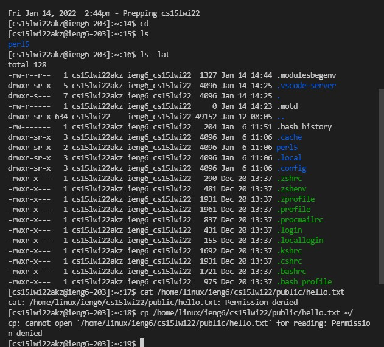
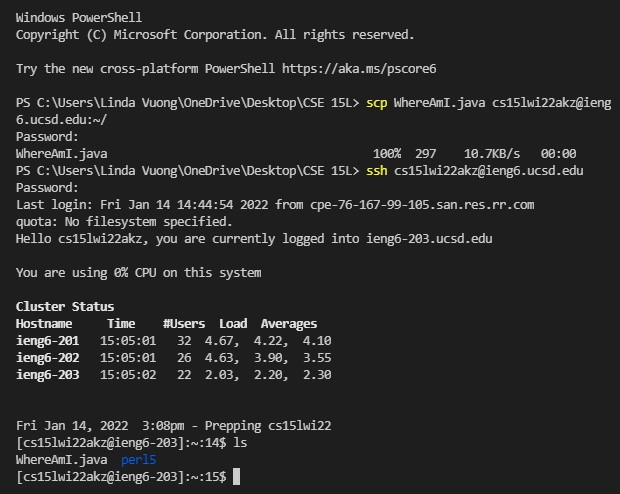

# **LAB REPORT 1**


Hello incoming 15L students!
This blog post will be a tutorial about how to log into your course-speical account on `ieng6` (the UCSD basement server). 

---

## Step 1: *Installing VScode*
Go to [Visual Studio Code](https://code.visualstudio.com/) and download and install it on your device.

> It should look something like this (may differ depending on system/ display settings).


## Step 2: *Remotely Connecting*
Here we will be connecting VScode to a remote device over the Internet!

Since I'm operating on Windows, I'll be giving instructions for Window users (my apologies to other users reading this). 

1. Install [OpenSSH](https://docs.microsoft.com/en-us/windows-server/administration/openssh/openssh_install_firstuse) using the link attached.
2. Look up your course-specific account for CSE15L : [CSE15L-Account](https://sdacs.ucsd.edu/~icc/index.php)
3. Open your terminal in VSCode using the Terminal menu and type in a `ssh` command replacing my account with your own.

    ``` $ ssh cs15lwi22akz@ieng6.ucsd.edu```

    Continue connecting by pressing "yes", enter your password and you should get something like this
    > 

Congrats! Your terminal is now connected to a computer in the UCSD CSE basement! 


## Step 3: *Trying Some Commands*
Now that everything's set up, let's try running some commands!
Here are some commands to try:
- `cd`
- `cd ~`
- `ls` 
- `ls -lat`
- `pwd`
- `cp /home/linux/ieng6/cs15lwi22/public/hello.txt ~/`
- `cat /home/linux/ieng6/cs15lwi22/public/hello.txt`

> Here's an example of how mine looks:



## Step 4: *Moving Files with scp*
 *A key step in working remotely is being able to copy files between computers.*

 We'll be copying a file from our computer to a remote computer in this exercise by using a command called `scp`, which stands for secure copy.

 1. Create a file on your computer called `WhereAmI.java` with the following contents in it:
     ```
     class WhereAmI { 
         public static void main(String[] args) {
             System.out.println(System.getProperty("os.name"));
             System.out.println(System.getProperty("user.name"));
             System.out.println(System.getProperty("user.home"));
              System.out.println(System.getProperty("user.dir"));
            }
        }
    ```
    2. In the terminal from the directory where `WhereAmI.java` was made, run the command using: (but with your username)
    ``` scp WhereAmI.java cs15lwi22zakz@ieng6.ucsd.edu:~```
    3. Enter your password!
    Now, log into `ieng6` again using the `ssh` command and use `ls`.
        > You should see something along these lines!
        


## Step 5: *Setting an SSH Key*
Using `ssh` keys is a way to make logging in or running `scp` a little less tedious (by us not having to type in our password 10,000 times). 

1. Run this to set up `ssh-keygen`, a program that creates a pair of files called the *public key* and *private key*
    > Replace my name with yours!
    ```
    # on client (your computer)
    $ ssh-keygen
    Generating public/private rsa key pair.
    Enter file in which to save the key (C:\Users\Linda Vuong/.ssh/id_rsa): \Users\Linda Vuong/.ssh/id_rsa
    Enter passphrase (empty for no passphrase): 
    Enter same passphrase again: 
    Your identification has been saved in \Users\Linda Vuong/.ssh/id_rsa.
    Your public key has been saved in \Users\Linda Vuong/.ssh/id_rsa.pub.
    The key fingerprint is:
    SHA256:ay5ICgx/MrP2brsHxZ5R0xEiNBZ3VkDSzRWUEDTsppc linda vuong@DESKTOP-KTSE4VM
    The key's randomart image is:
    +---[RSA 3072]----+
    |                 |
    |       . . + .   |
    |      . . B o .  |
    |     . . B * +.. |
    |      o S = *.B. |
    |       = = O.*.*+|
    |        + * *.BE+|
    |           +.+.o |
    |             ..  |
    +----[SHA256]-----+
    ```
    2. Windows operators need to follow extra `ssh-add` steps: [ssh-add-steps](https://docs.microsoft.com/en-us/windows-server/administration/openssh/openssh_keymanagement#user-key-generation)
    3. To copy the public key to `.ssh`'s directory: (Make sure you're using your user!!)

    ``` 
    $ ssh cs15lwi22akz@ieng6.ucsd.edu
    Enter Password
    # now on server
    $ mkdir .ssh
    $ logout
    # back on client
    $ scp \Users\Linda Vuong/.ssh/id_rsa.pub cs15lwi22@ieng6.ucsd.edu:~/.ssh/authorized_keys 
    ```
    
    [Hello this is Linda : I'm having a problem implementing this Step since I'm operating on Windows]

    

## Step 6: *Optimizing Remote Running*
Now you'll be using everything in this tutorial to make some local edits to `WhereAmI.java`, then copying it to the remote server and running it.

- To directly run on the remote server: write commands in quotes at the end of an `ssh` command
    > `ssh cs151wi22@ieng6.ucsd.edu "ls" `

- Use semicolons to run multiple commands on the same line
    > `sp WhereAmI.java OtherMain.java; javac OtherMain.java; java WhereAmI" `

--- 


***THANKS FOR TUNING IN TO THIS TUTORIAL! HOPE TO SEE YOU SOON & STAY SAFE OUT THERE***

